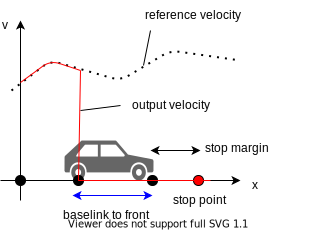

# obstacle_stop_planner

## Purpose

`obstacle_stop_planner` is a node to modify trajectory's velocity based on obstacles(represented as pointcloud and bounding boxes).

`obstacle_stop_planner` has 3 features.

1. stop_planner
    - Stop if obstacle is in the detection area
2. slow_down_planner
    - Slow down if obstacle is in the detection area(larger than stop_planner's one)
3. adaptive_cruise_planner
    - Adjust velocity based on front obstacles

## Inner-workings/Algorithms

### Conceptual Flow Charts

### How to search collisions

1. Generate a detection area considering the ego-vehicle’s shape
2. Search obstacle pointcloud in the detection area
    - To reduce calculation cost, use 2 step search(roughly circular search and precise polygon search)

### How to set stop(or slow_down) velocity

1. Calculate vehicle's head pose considering a safe margin(`*_margin` parameter)
2. Calculate `base_link` pose from the head pose
    - Since Autoware's trajectory is based on `base_link` position, Planners should set velocity of `base_link` at each point
3. Insert a new pose that has stop(or slow_down) velocity to trajectory
4. Modify velocity in trajectory based on the inserted pose
    - When stopping, set zero velocity until trajectory end in order to stop for sure
    - When slowing down, set slow down velocity to a period

### How to follow front obstacles adaptively

1. Infer a velocity of front obstacles

    - When using dynamic objects
        - Just take the velocity in the object
    - When using pointcloud
        - Calculate velocity from delta-movement of the nearest point

2. Plan velocity based on the relationship between ego-vehicle and front obstacles

    - Suppose both ego-vehicle and obstacles follow constant acceleration model
    - Suppose obstacles will slightly slow down in order to be conservative and to avoid crash
        - Since it's difficult to estimate acceleration precisely, giving it as a parameter
    - Calculate a suitable distance to obstacle considering `free running distance`, `braking distance`, etc.
    - When the distance to obstacle becomes lower than a limit, the vehicle pauses adaptive cruising and will try to stop before crash

## Inputs/Outputs

Input:

| Name                          | Type                                                | Description          |
| ----------------------------- | --------------------------------------------------- | -------------------- |
| `/tf`                         | `tf2_msgs::msg::TFMessage`                          | transform            |
| `~/input/trajectory`          | `autoware_planning_msgs::msg::Trajectory`           | reference trajectory |
| `~/input/twist`               | `sensor_msgs::msg::sensor_msgs`                     | current velocity     |
| `~/input/obstacle_pointcloud` | `sensor_msgs::msg::PointCloud2`                     | obstacle pointcloud  |
| `~/input/dynamic_objects`     | `autoware_perception_msgs::msg::DynamicObjectArray` | dynamic objects      |

Output:

| Name                  | Type                                      | Description         |
| --------------------- | ----------------------------------------- | ------------------- |
| `~/output/trajectory` | `autoware_planning_msgs::msg::Trajectory` | modified trajectory |

## Parameters

### stop_planner

| Parameter                  | Type   | Description                                                                   |
| -------------------------- | ------ | ----------------------------------------------------------------------------- |
| `stop_margin`              | double | stop margin distance from obstacle on the path [m]                            |
| `min_behavior_stop_margin` | double | stop margin distance when any other stop point is inserted in stop margin [m] |
| `step_length`              | double | step length for pointcloud search range [m]                                   |
| `extend_distance`          | double | extend trajectory to consider after goal obstacle in the extend_distance      |
| `expand_stop_range`        | double | margin of vehicle footprint [m]                                               |

### slow_down_planner

| Parameter                | Type   | Description                                                                                    |
| ------------------------ | ------ | ---------------------------------------------------------------------------------------------- |
| `slow_down_margin`       | double | margin distance from slow down point [m]                                                       |
| `expand_slow_down_range` | double | offset from vehicle side edge for expanding the search area of the surrounding point cloud [m] |
| `max_slow_down_vel`      | double | max slow down velocity [m/s]                                                                   |
| `min_slow_down_vel`      | double | min slow down velocity [m/s]                                                                   |

### adaptive_cruise_planner

| Parameter                                | Type   | Description                                                                                                  |
| ---------------------------------------- | ------ | ------------------------------------------------------------------------------------------------------------ |
| adaptive cruise                          |        |                                                                                                              |
| `use_object_to_estimate_vel`             | bool   | use tracking objects for estimating object velocity or not                                                   |
| `use_pcl_to_estimate_vel`                | bool   | use pcl for estimating object velocity or not                                                                |
| `consider_obj_velocity`                  | bool   | consider forward vehicle velocity to ACC or not                                                              |
| general                                  |
| `obstacle_stop_velocity_thresh`          | double | threshold of forward obstacle velocity to insert stop line (to stop acc) [m/s]                               |
| `emergency_stop_acceleration`            | double | supposed minimum acceleration (deceleration) in emergency stop [m/ss]                                        |
| `emergency_stop_idling_time`             | double | supposed idling time to start emergency stop [s]                                                             |
| `min_dist_stop`                          | double | minimum distance of emergency stop [m]                                                                       |
| `obstacle_emergency_stop_acceleration`   | double | supposed minimum acceleration (deceleration) in emergency stop [m/ss]                                        |
| `max_standard_acceleration`              | double | supposed maximum acceleration in active cruise control [m/ss]                                                |
| `min_standard_acceleration`              | double | supposed minimum acceleration (deceleration) in active cruise control                                        |
| `standard_idling_time`                   | double | supposed idling time to react object in active cruise control [s]                                            |
| `min_dist_standard`                      | double | minimum distance in active cruise control [m]                                                                |
| `obstacle_min_standard_acceleration`     | double | supposed minimum acceleration of forward obstacle [m/ss]                                                     |
| `margin_rate_to_change_vel`              | double | margin to insert upper velocity [-]                                                                          |
| `use_time_compensation_to_calc_distance` | bool   | use time-compensation to calculate distance to forward vehicle                                               |
| pid                                      |        |                                                                                                              |
| `p_coefficient_positive`                 | double | coefficient P in PID control (used when target dist -current_dist >=0) [-]                                   |
| `p_coefficient_negative`                 | double | coefficient P in PID control (used when target dist -current_dist <0) [-]                                    |
| `d_coefficient_positive`                 | double | coefficient D in PID control (used when delta_dist >=0) [-]                                                  |
| `d_coefficient_negative`                 | double | coefficient D in PID control (used when delta_dist <0) [-]                                                   |
| object velocity estimation               |        |                                                                                                              |
| `object_polygon_length_margin`           | double | The distance to extend the polygon length the object in pointcloud-object matching [m]                       |
| `object_polygon_width_margin`            | double | The distance to extend the polygon width the object in pointcloud-object matching [m]                        |
| `valid_estimated_vel_diff_time`          | double | Maximum time difference treated as continuous points in speed estimation using a point cloud [s]             |
| `valid_vel_que_time`                     | double | Time width of information used for speed estimation in speed estimation using a point cloud [s]              |
| `valid_estimated_vel_max`                | double | Maximum value of valid speed estimation results in speed estimation using a point cloud [m/s]                |
| `valid_estimated_vel_min`                | double | Minimum value of valid speed estimation results in speed estimation using a point cloud [m/s]                |
| `thresh_vel_to_stop`                     | double | Embed a stop line if the maximum speed calculated by ACC is lower than this speed [m/s]                      |
| `lowpass_gain_of_upper_velocity`         | double | Lowpass-gain of upper velocity                                                                               |
| `use_rough_velocity_estimation`          | bool   | Use rough estimated velocity if the velocity estimation is failed                                            |
| `rough_velocity_rate`                    | double | In the rough velocity estimation, the velocity of front car is estimated as self current velocity this value |

## Assumptions/Known limits

The tracking algorithm in `adaptive_cruise_planner` is very simple, so basically it's not recommended.
When you use it, please take care of the vehicle's behavior as much as possible and always be ready for overriding.

## Future extensions/Unimplemented parts

Currently, all obstacle's pointcloud is input to `obstacle_stop_planner`, but it forces `obstacle_stop_planner` to estimate velocity of pointcloud that includes moving vehicles.
If it doesn't estimate velocity of pointcloud, it recognizes all obstacles as stopped and the cruising speed goes quite low so the ego-vehicle can't drive on public roads smoothly.
Therefore, it's preferable we have an advanced tracker in the former stages and pass only limited objects(static obstacles + untracked objects) to `obstacle_stop_planner`.
