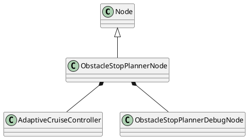
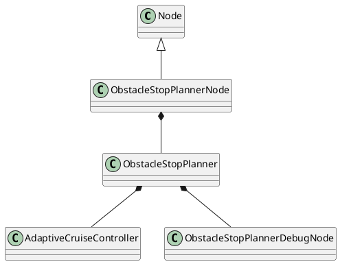

class ObstacleStopPlannerNode

Key input: pathCallback(input/trajectory)

Class diagram


Proposal class diagram


Callback

void obstaclePointcloudCallback(const sensor_msgs::msg::PointCloud2::ConstSharedPtr input_msg);

void pathCallback(const autoware_planning_msgs::msg::Trajectory::ConstSharedPtr input_msg);

```
path_pub_->publish(output_msg);
stop_reason_diag_pub_->publish(stop_reason_diag);
debug_ptr_->publish();
```

基本はこのメソッドで処理を行っている。長いが、構造はシンプル。

void dynamicObjectCallback(
const autoware_perception_msgs::msg::DynamicObjectArray::ConstSharedPtr input_msg);
void currentVelocityCallback(const geometry_msgs::msg::TwistStamped::ConstSharedPtr input_msg);
void externalExpandStopRangeCallback(
const autoware_debug_msgs::msg::Float32Stamped::ConstSharedPtr input_msg);

Publisher

rclcpp::Publisher<autoware*planning_msgs::msg::Trajectory>::SharedPtr path_pub*;
rclcpp::Publisher<diagnostic*msgs::msg::DiagnosticStatus>::SharedPtr stop_reason_diag_pub*;


---

class AdaptiveCruiseController

publicメソッドは1つのみ。insertAdaptiveCruiseVelocity()というメソッドでTrajectoryを出力していることから、速度を調整しているっぽい。
Publisherはdebug用のメッセージのみ。


---

class ObstacleStopPlannerDebugNode

図形を保持してPublishしている？
PublishするタイミングはpathCallback。
